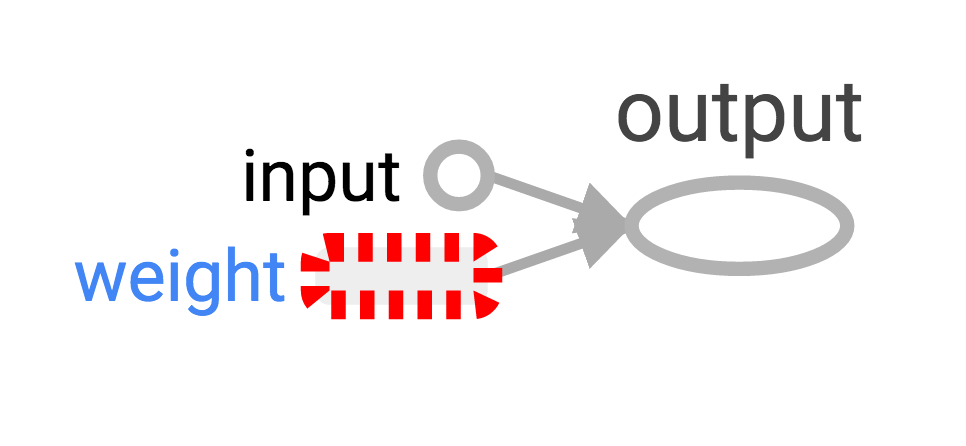
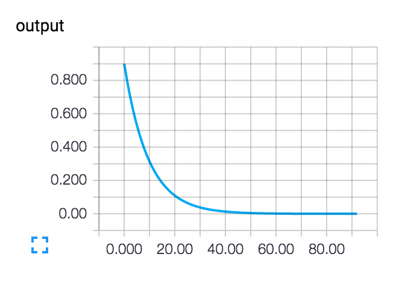

# TensorFlow from the Plumbing Up

The TensorFlow project might be bigger than you realize. It's a
library for deep learning, yes. That affiliation, and its connection
to Google, has helped TensorFlow attract a lot of attention. But
TensorFlow is more than "just" deep learning. The core library is
suited to a broad family of machine learning techniques. Linear
algebra and other "internals" are prominently exposed. The execution
model is unfamiliar to those coming from Python's scikit-learn, or
most tools in R. And in addition to the core machine learning
functionality, TensorFlow also includes its own logging system, its
own interactive log visualizer, and even its own heavily engineered
serving architecture. Especially for someone hoping to explore machine
learning for the first time with TensorFlow, it can be a lot to take
in.

How does TensorFlow work? Let's break it down so that we can see and
understand every moving part. We'll explore the data flow graph, how
TensorFlow does learning, and how TensorBoard can visualize TensorFlow
work. The examples here won't solve industrial machine learning
problems, but they'll help you understand the components underlying
everything built with TensorFlow, including whatever you build next!


### Python Points to the Graph

The way TensorFlow manages computation is not totally different from
the usual way we use Python. With both it's important to remember, to
paraphrase [Hadley Wickham][], that "an object has no name."

[Hadley Wickham]: https://twitter.com/hadleywickham/status/732288980549390336


The variable names in Python code aren't what they represent; they're
just pointing at objects. So when you say in Python that `foo = []`
and `bar = foo`, it isn't just that `foo` equals `bar`; `foo` _is_
`bar`, in the sense that they both point at the same list object.

```python
>>> foo = []
>>> bar = foo
>>> foo == bar
## True
>>> foo is bar
## True
```

You can also see that `id(foo)` and `id(bar)` are the same. This
identity, especially with [mutable][] data structures like lists, can
lead to surprising bugs when it's misunderstood.

[mutable]: https://codehabitude.com/2013/12/24/python-objects-mutable-vs-immutable/

Internally, Python is managing all your objects and keeping track of
your variable names and which objects they refer to. TensorFlow adds
another analogous system.

When you enter a Python expression, for example at the interactive
interpreter or REPL (Read Evaluate Print Loop), whatever is read is
almost always evaluated right away. Python is eager to do what you
tell it. So if I tell Python to `foo.append(bar)`, it appends right
away, even if I never use `foo` again. A lazier alternative would be
to just remember that I said `foo.append(bar)`, and if I ever evaluate
`foo` at some point in the future, Python could do the append then.
This would be closer to how TensorFlow behaves, where defining
relationships is entirely separate from evaluating what the results
are.

Recall that `foo` and `bar` refer to the same list. We've put a list
inside itself. You could think of this structure as a graph with one
node, pointing to itself. Nesting lists is one way to represent a
graph structure like a TensorFlow computation graph.

```python
>>> foo.append(bar)
>>> foo
## [[...]]
```


### The Simplest TensorFlow Graph

TensorFlow is admirably easier to [install][] than some other
frameworks. The examples here work with either Python 2.7 or 3.3+, and
the TensorFlow version used is 0.8.

[install]: https://www.tensorflow.org/versions/r0.8/get_started/os_setup.html

```python
>>> import tensorflow as tf
```

At this point TensorFlow has already started managing a lot of state
for us. There's already an implicit default graph, for example.
[Internally][] the default graph lives in the `_default_graph_stack`,
but we don't have access to that directly. We use
`tf.get_default_graph()`.

[Internally]: https://github.com/tensorflow/tensorflow/blob/v0.8.0/tensorflow/python/framework/ops.py#L3399

```python
>>> graph = tf.get_default_graph()
```

The nodes of the TensorFlow graph are called "operations". We can see
what operations are in the graph with `graph.get_operations()`.

```python
>>> graph.get_operations()
## []
```

Currently, there isn't anything in the graph. Everything we want
TensorFlow to compute will have to get into that graph. Let's start
with a simple constant input value of one.

```python
input_value = tf.constant(1.0)
```

That constant now lives as a node, an operation, in the graph. The
Python variable name `input_value` refers indirectly to that
operation, but we can also find the operation in the default graph.

```python
>>> operations = graph.get_operations()
>>> operations
## [<tensorflow.python.framework.ops.Operation at 0x1185005d0>]
>>> operations[0].node_def
## name: "Const"
## op: "Const"
## attr {
##   key: "dtype"
##   value {
##     type: DT_FLOAT
##   }
## }
## attr {
##   key: "value"
##   value {
##     tensor {
##       dtype: DT_FLOAT
##       tensor_shape {
##       }
##       float_val: 1.0
##     }
##   }
## }
```

TensorFlow uses [protocol buffers][] internally. Printing the
`node_def` for the constant operation above shows what's in
TensorFlow's protocol buffer representation for the number one!

[protocol buffers]: https://developers.google.com/protocol-buffers/

People new to TensorFlow sometimes wonder why there's all this fuss
about making "TensorFlow versions" of things. Why can't we just use a
normal Python variable without also defining a TensorFlow object?
[One of the TensorFlow tutorials][] has an explanation:

[One of the TensorFlow tutorials]: https://www.tensorflow.org/versions/r0.8/tutorials/mnist/pros/index.html#deep-mnist-for-experts

> To do efficient numerical computing in Python, we typically use
> libraries like NumPy that do expensive operations such as matrix
> multiplication outside Python, using highly efficient code
> implemented in another language. Unfortunately, there can still be a
> lot of overhead from switching back to Python every operation. This
> overhead is especially bad if you want to run computations on GPUs
> or in a distributed manner, where there can be a high cost to
> transferring data.

> TensorFlow also does its heavy lifting outside Python, but it takes
> things a step further to avoid this overhead. Instead of running a
> single expensive operation independently from Python, TensorFlow
> lets us describe a graph of interacting operations that run entirely
> outside Python. This approach is similar to that used in Theano or
> Torch.

TensorFlow can do a lot of great things, but it can only work with
what's been explicitly given over to it. This is true even for a
single constant!

If we inspect our `input_value`, we see it is a constant 32-bit float
tensor of no dimension: just one number.

```python
>>> input_value
## <tf.Tensor 'Const:0' shape=() dtype=float32>
```

Note that this _doesn't_ tell us what that number _is_! To evaluate
`input_value` and get a numerical value out, we need to create a
"session" where graph operations can be evaluated and then explicitly
ask to evaluate or "run" `input_value`.

```python
>>> sess = tf.Session()
>>> sess.run(input_value)
## 1.0
```

It may feel a little strange to "run" a constant. But it isn't so
different from evaluating an expression as usual in Python; it's just
that TensorFlow is managing its own space of things - the
computational graph - and it has its own method of evaluation.


### The Simplest Neuron

Let's build a "neuron" with just one parameter, or "weight". Often
even simple neurons also have a bias term, but we'll leave that out.

The neuron's weight isn't going to be constant; we expect it to change
in order to learn based on the "true" input and output we use for
training. The weight will be a TensorFlow [variable][]. We'll give
that variable a starting value of 0.9.

[variable]: https://www.tensorflow.org/versions/r0.8/how_tos/variables/

```python
>>> weight = tf.Variable(0.9)
```

You might expect that adding a variable would add one operation to the
graph, but in fact that one line adds four operations. We can check
all the operation names:

```python
>>> for op in graph.get_operations(): print op.name
## Const
## Variable/initial_value
## Variable
## Variable/Assign
## Variable/read
```

We won't want to follow every operation individually for long, but it
will be nice to see at least one that feels like a real computation.

```python
>>> output_value = weight * input_value
```

Now there are six operations in the graph, and the last one is that
multiplication.

```python
>>> op = graph.get_operations()[-1]
>>> op.name
## 'mul'
>>> for input_op in op.inputs: print input_op
## Tensor("Variable/read:0", shape=(), dtype=float32)
## Tensor("Const:0", shape=(), dtype=float32)
```

This shows how the multiplication operation tracks where its inputs
come from: they come from other operations in the graph. To understand
a whole graph, following references this way quickly becomes tedious
for humans. [TensorBoard graph visualization][] is designed to help.

[TensorBoard graph visualization]: https://www.tensorflow.org/versions/r0.8/how_tos/graph_viz/

How do we find out what the product is? We have to "run" the
`output_value` operation. But that operation depends on a variable,
`weight`. We told TensorFlow that the initial value of `weight` should
be 0.9, but there isn't yet an operation in the graph that will
actually set that value, and the value hasn't yet been set in the
current session. The `tf.initialize_all_variables()` function
generates the appropriate operation, which can then be run.

```python
>>> init = tf.initialize_all_variables()
>>> sess.run(init)
```

The `tf.initialize_all_variables()` function makes initializers for
all the variables _in the current graph_, so if you added more
variables you'll want to use `tf.initialize_all_variables()` again; a
stale `init` wouldn't include the new variables.

Now we're ready to run the `output_value` operation.

```python
>>> sess.run(output_value)
## 0.89999998
```

Recall that's `0.9 * 1.0` with 32-bit floats, and 32-bit floats have a
hard time with 0.9; 0.89999998 is as close as they can get.


### See Your Graph in TensorBoard

The graph to this point is simple, but already it would be nice to see
it represented in a diagram. We'll use TensorBoard to generate that
diagram. TensorBoard reads the `name` that is stored inside each
operation (quite distinct from Python variable names). We can use
these TensorFlow names and switch to more conventional Python variable
names.

```python
>>> x = tf.constant(1.0, name='input')
>>> w = tf.Variable(0.9, name='weight')
>>> y = tf.mul(w, x, name='output')
```

TensorBoard works by looking at a directory of output created from
TensorFlow sessions. We can write this output with a `SummaryWriter`,
and if we do nothing beside creating one with a graph, it will just
write out that graph.

The first argument when creating the `SummaryWriter` is an output
directory name, which will be created if it doesn't exist.

```python
>>> summary_writer = tf.train.SummaryWriter('log_simple_graph', sess.graph)
```

Now, at the command line, we can start up TensorBoard.

```bash
$ tensorboard --logdir=log_simple_graph
```

TensorBoard runs as a local web app, on port 6006. ("6006" is "goog"
upside-down.) If you go to [localhost:6006/#graphs][] you should see a
diagram of the graph you created in TensorFlow, which looks something
like this:

[localhost:6006/#graphs]: http://localhost:6006/#graphs




### Making the Neuron Learn

What is our neuron supposed to learn? We set up an input value of 1.0.
Let's say the correct output value is zero. That is, we have a very
simple "training set" of just one example with one feature, which has
the value one, and one label, which is zero. We want the neuron to
learn the function taking one to zero.

Currently, the system takes the input one and returns 0.9, which is
not correct. We need a way to measure how wrong the system is. We'll
call that measure of wrongness the "loss" and give our system the goal
of minimizing the loss. If the loss can be negative then minimizing it
could be silly, so let's make the loss the square of the difference
between the current output and the desired output.

```python
>>> y_ = tf.constant(0.0)
>>> loss = (y - y_)**2
```

So far, nothing in the graph does any learning. For that, we need an
optimizer. We'll use a gradient descent optimizer so that we can
update the weight based on the derivative of the loss. The optimizer
takes a learning rate to moderate the size of the updates, which we'll
set at 0.05.

```python
>>> optim = tf.train.GradientDescentOptimizer(learning_rate=0.05)
```

The optimizer is remarkably clever. It can automatically work out and
apply the appropriate gradients through a whole network, carrying out
the backward step for learning.

Let's see what the gradient looks like for our simple example.

```python
>>> grads_and_vars = optim.compute_gradients(loss)
>>> sess.run(tf.initialize_all_variables())
>>> sess.run(grads_and_vars[0][0])
## 1.8
```

Why is it 1.8? Our loss is error squared, and the derivative of that
is two times the error. Currently the system says 0.9 instead of 0, so
the error is 0.9, and two times 0.9 is 1.8. It's working!

For more complex systems, it will be very nice indeed that TensorFlow
calculates and then applies these gradients for us automatically.

Let's apply the gradient, finishing the backpropagation.

```python
>>> sess.run(optim.apply_gradients(grads_and_vars))
>>> sess.run(w)
## 0.81
```

The weight decreased by 0.09 because the optimizer subtracted the
gradient times the learning rate, 1.8 * 0.05, pushing the weight in
the right direction.

Instead of hand-holding the optimizer like this, we can make one
operation that calculates and applies the gradients: the `train_step`.

```python
>>> train_step = tf.train.GradientDescentOptimizer(0.05).minimize(loss)
>>> for i in range(50):
>>>     sess.run(train_step)
>>>
>>> sess.run(y)
## 0.0046383981
```

Running the training step many times, the weight and so the output
value are now very close to zero. The neuron has learned!


### Training Diagnostics in TensorBoard

We may be interested in what's happening during training. Say we want
to follow what our system is predicting at every training step. We
could `print` from inside the training loop.

```python
>>> sess.run(tf.initialize_all_variables())
>>> for i in range(50):
>>>     print('before step {}, y is {}'.format(i, sess.run(y)))
>>>     sess.run(train_step)
>>>
## before step 0, y is 0.899999976158
## before step 1, y is 0.810000002384
## ...
## before step 48, y is 0.0057264175266
## before step 49, y is 0.00515377568081
```

This works, but there are some problems. It's hard to understand a
list of numbers. A plot would be better. And even with only one value
to monitor, there's too much output to read. We're likely to want to
monitor many things. It would be nice to record everything in some
organized way.

Luckily, the same system that we used earlier to visualize the graph
also has just the mechanisms we need!

We instrument the computation graph by adding operations that
summarize its state. Here we'll create an operation that reports the
current value of `y`, the neuron's current output.

```python
>>> summary_y = tf.scalar_summary('output', y)
```

When you run a summary operation it returns a string of protocol
buffer text which can be written to a log directory with a
`SummaryWriter`.

```python
>>> summary_writer = tf.train.SummaryWriter('log_simple_stat')
>>> sess.run(tf.initialize_all_variables())
>>> for i in range(50):
>>>    summary_str = sess.run(summary_y)
>>>    summary_writer.add_summary(summary_str, i)
>>>    sess.run(train_step)
>>>
```

Now after running `tensorboard --logdir=log_simple_stat`, you get an
interactive plot at [localhost:6006/#events][].

[localhost:6006/#events]: http://localhost:6006/#events




### Flowing Onward

Here's a final version of the code. It's fairly minimal, with every
part showing useful (and understandable!) TensorFlow functionality.

```python
import tensorflow as tf

x = tf.constant(1.0, name='input')
w = tf.Variable(0.9, name='weight')
y = tf.mul(w, x, name='output')
y_ = tf.constant(0.0, name='correct_value')
loss = tf.pow(y - y_, 2, name='loss')
train_step = tf.train.GradientDescentOptimizer(0.05).minimize(loss)

for value in [x, w, y, y_, loss]:
    tf.scalar_summary(value.op.name, value)
summaries = tf.merge_all_summaries()

sess = tf.Session()
summary_writer = tf.train.SummaryWriter('log_simple_stats', sess.graph)

sess.run(tf.initialize_all_variables())
for i in range(50):
   summary_writer.add_summary(sess.run(summaries), i)
   sess.run(train_step)
```

The example here is even simpler than the ones that inspired it in
Michael Nielsen's [Neural Networks and Deep Learning][]. For myself,
seeing the details of examples like these helps with understanding and
building more complex systems that use and extend from simple building
blocks. Part of the beauty of TensorFlow is how flexibly you can build
complex systems from simpler components.

[Neural Networks and Deep Learning]: http://neuralnetworksanddeeplearning.com/

If you want to continue experimenting with TensorFlow, it might be fun
to start making more interesting neurons, perhaps with different
[activation functions][]. You could train with more [interesting][]
[data][]. You could add more neurons. You could add more layers. You
could dive into more complex [pre-build models][]. Go for it!

[activation functions]: https://en.wikipedia.org/wiki/Activation_function#Comparison_of_activation_functions
[interesting]: https://www.cs.utoronto.ca/~kriz/cifar.html
[data]: http://yann.lecun.com/exdb/mnist/
[pre-build models]: https://github.com/tensorflow/tensorflow/tree/master/tensorflow/models
